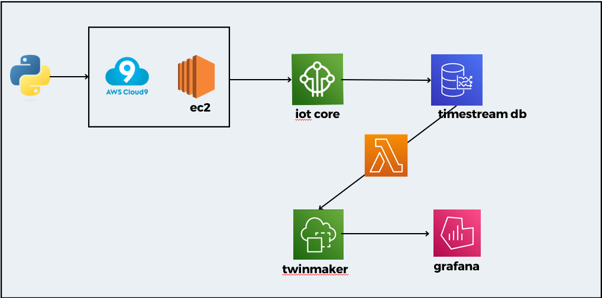

# AWS IoT Digital Twin Project

This project demonstrates the implementation of an IoT digital twin using AWS services.

## Table of Contents

- [Introduction](#introduction)
- [Features](#features)
- [Prerequisites](#prerequisites)
- [Installation](#installation)
- [Usage](#usage)
- [Contributing](#contributing)
- [License](#license)

## Introduction

In this project, we leverage AWS IoT services to create a digital twin for an Iot Smart Gardening System. A digital twin is a virtual representation of a physical device or system that allows monitoring, control, and analysis of the device's data in real-time.

## Architecture

## Features

- **AWS Cloud9**: Integrated development environment (IDE) for writing, running, and debugging code.
- **AWS EC2**: Virtual servers in the cloud for scalable computing capacity.
- **AWS IoT Core**: Connect the physical device to AWS IoT Core for secure communication and device management.
- **AWS TimeStream**: Managed time series database for storing and analyzing IoT data.
- **AWS Lambda**: Use AWS Lambda functions to perform custom actions based on the data received from the digital twin.
- **AWS TwinMaker**: Tool for creating and managing digital twins in AWS IoT Core.
- **AWS Grafana**: Open-source analytics and monitoring platform for visualizing IoT data.

## Prerequisites

- AWS account
- AWS CLI installed and configured
- Python 3.x
-  library

## Contributing

Contributions are welcome! If you have any ideas, suggestions, or bug reports, please open an issue or submit a pull request.

## License

This project is licensed under the [MIT License](LICENSE).